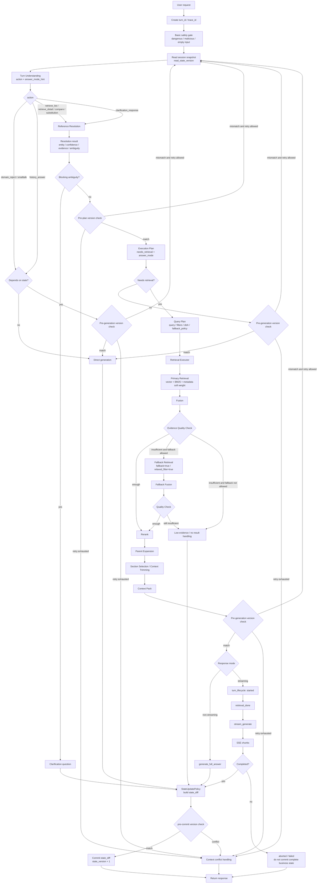

# Main Runtime Architecture Spec

Status: frozen baseline
Owner: C8 recipe RAG system
Last updated: 2026-07-06

This document is the baseline architecture contract for future C8 RAG work. New implementation work should follow this runtime flow unless a later architecture review explicitly replaces this spec.

## Goal

Keep the system as a focused multi-turn recipe RAG runtime, not a general agent framework. The main chain must handle domain routing, follow-up understanding, reference resolution, retrieval quality, fallback control, streaming lifecycle, and typed state writeback without widening the architecture unnecessarily.

## Frozen Main Chain



## Node Contracts

### Turn Understanding

Turn Understanding must produce an explicit action. Domain decisions must have control-flow authority; they must not be only descriptive labels.

```python
{
    "action": "domain_reject | smalltalk | history_answer | retrieve_list | retrieve_detail | compare | substitution | clarification_response",
    "answer_mode_hint": "safe_direct | recommendation | recipe_detail | comparison | substitution | troubleshooting | history_based",
    "depends_on_state": True,
    "needs_reference_resolution": True,
    "domain_confidence": 0.0,
    "reason": "short diagnostic reason"
}
```

Required behavior:

- `domain_reject` handles harmless but out-of-domain requests, such as programming advice.
- `smalltalk` handles greetings, thanks, and identity questions without touching recipe state.
- Follow-up-looking text must only become recipe follow-up if the snapshot provides valid evidence.
- Unsafe or malicious input is handled earlier by the basic safety gate.

### Reference Resolution

Reference resolution must return structured evidence and confidence. It must not be a hidden yes/no branch.

```python
{
    "resolved_entity": "宫保鸡丁",
    "confidence": 0.91,
    "evidence_source": "last_recommendation_list[0]",
    "ambiguity_reason": None,
    "blocking_ambiguity": False
}
```

Required behavior:

- Only `blocking_ambiguity=True` may directly trigger a clarification question.
- Low confidence without blocking ambiguity should continue through planning with conservative retrieval or conservative answer wording.
- If a previous recommendation list was aborted, empty, or superseded, ordinal references must not resolve silently.

### Execution Plan

Execution Plan decides whether the turn needs retrieval and which answer mode should be used.

```python
{
    "needs_retrieval": True,
    "answer_mode": "recommendation | recipe_detail | comparison | substitution | troubleshooting | history_based | safe_direct",
    "requires_state_check": True,
    "reason": "short diagnostic reason"
}
```

Execution Plan does not own clarification. Blocking clarification belongs to Reference Resolution.

### Query Plan

Query Plan is retrieval-facing only.

```python
{
    "query": "宫保鸡丁 做法",
    "dish_name": "宫保鸡丁",
    "filters": {"content_type": "steps"},
    "top_k": 3,
    "fallback_policy": "disabled | relaxed_filters | broad_search",
    "hard_filters": ["dish_name"],
    "soft_filters": ["ingredient", "taste", "difficulty", "time", "health_preference"]
}
```

Required behavior:

- Explicit dish name can be a hard filter.
- Content type can be a hard or strong preferred filter depending on intent.
- Ingredient, taste, difficulty, time, and health preferences should normally be soft weighted, not hard filtered.

### Retrieval Executor

Retrieval Executor is the only layer that decides how retrieval is executed.

Required order:

1. Primary retrieval: vector + BM25 + metadata soft weighting.
2. Fusion: combine vector, BM25, and metadata weights.
3. Evidence Quality Check.
4. Optional fallback only when policy allows it and evidence is insufficient.
5. Rerank after enough candidates exist.
6. Parent expansion.
7. Section selection and context trimming.
8. Context pack.

Fallback must not always run. Fallback results must carry `fallback=true` or `relaxed_filter=true`, and generation must treat them as weaker evidence.

### Evidence Quality Check

Evidence Quality Check controls whether the system has enough support to answer.

```python
{
    "enough_evidence": True,
    "allow_fallback": False,
    "fallback_used": False,
    "relaxed_filter": False,
    "quality_reason": "exact_dish_and_steps_matched"
}
```

Quality checks should consider:

- no candidates;
- low scores;
- conflicting candidate dishes;
- missing requested content type;
- fallback-only match;
- exact dish requested but absent from the knowledge base.

### Low Evidence / No Result Handling

`LOW` is a result-producing node, not just a decision point.

```python
{
    "answer_type": "no_result | low_confidence | need_clarification",
    "answer": "可返回给用户的文本",
    "state_diff_policy": "low_evidence",
    "quality_reason": "exact_dish_not_found"
}
```

Required behavior:

- `no_result` is used when evidence is insufficient and fallback is not allowed or failed.
- `low_confidence` is used when weak evidence exists and a conservative answer is acceptable.
- `need_clarification` is used when a user choice can resolve the evidence problem.
- Low-evidence paths must not update business entities such as `current_dish`.

## State Model

The session state should expose at least these fields:

```python
{
    "state_version": 7,
    "current_dish": "宫保鸡丁",
    "current_entities": ["宫保鸡丁", "鱼香肉丝"],
    "last_recommendation_list": ["宫保鸡丁", "香菇滑鸡", "可乐鸡翅"],
    "last_answer_type": "recipe_detail",
    "pending_clarification": None,
    "resolved_references": [],
    "turn_lifecycle": {},
    "history": []
}
```

State writes must be made through a state diff. Generation functions must not modify session state directly.

## StateUpdatePolicy

Implement one central policy function, conceptually:

```python
build_state_diff(answer_type, execution_result, old_state) -> dict
```

Field whitelist:

| answer_type | Allowed business state updates |
| --- | --- |
| `smalltalk` | Do not update business state. May update `last_answer_type`. |
| `domain_reject` | Do not update business state. May update `last_answer_type`. |
| `clarification` | Only update `pending_clarification` and `last_answer_type`. |
| `recommendation` | Update `last_recommendation_list` and `last_answer_type`. Do not overwrite `current_dish` unless explicitly resolved. |
| `detail` | Update `current_dish` only when resolution or retrieval quality is strong enough. |
| `comparison` | Update `current_entities` and `last_answer_type`. |
| `history_answer` | Prefer not to update business entities; update `last_answer_type`. |
| `low_confidence` | Do not update `current_dish`, `current_entities`, or `last_recommendation_list`. |
| `no_result` | Do not update business entities. |
| `stream_aborted` | Record lifecycle only; do not write a complete assistant answer. |

## Version Checks and Retry Budget

Each turn has one shared replan budget:

```python
max_replan_count = 1  # 2 is acceptable for local experiments
```

All version-check mismatch paths consume this shared budget. Do not give each version check its own retry counter.

Required version checks:

- after reading snapshot, store `read_state_version`;
- before generating any answer that depends on snapshot state;
- after reference resolution and before planning;
- before generation after context pack;
- before committing `state_diff`.

Pure smalltalk that does not depend on state may skip the pre-generation version check.

If the retry budget is exhausted, return context conflict handling rather than looping.

## Streaming Lifecycle

Streaming must branch before answer generation.

Lifecycle states:

```text
started -> retrieval_done -> streaming -> completed
started -> retrieval_done -> streaming -> aborted
started -> failed
```

Rules:

- Streaming must not commit a complete assistant answer until the stream completes.
- If the client disconnects or generation fails, mark the turn as `aborted` or `failed`.
- Aborted turns must not participate as complete answers in later reference resolution.
- Retrieval traces may be recorded before generation completes.

## Observability

Each turn should record enough trace data to explain behavior:

```python
{
    "turn_id": "...",
    "trace_id": "...",
    "original_query": "...",
    "action": "...",
    "answer_mode": "...",
    "resolved_entity": "...",
    "resolution_confidence": 0.91,
    "query_plan": {},
    "retrieval_quality": {},
    "selected_chunks": [],
    "selected_parent_docs": [],
    "fallback_used": False,
    "answer_type": "...",
    "state_diff": {},
    "state_version_before": 7,
    "state_version_after": 8
}
```

## Test Matrix

The frozen architecture must be validated with scenario tests before larger feature work.

| Scenario | Expected behavior |
| --- | --- |
| `推荐三个鸡肉菜 -> 第一个怎么做` | Ordinal resolves to the first recommendation and updates `current_dish` only after successful detail answer. |
| `推荐三个鸡肉菜 -> 谢谢 -> 第一个怎么做` | Smalltalk does not clear recommendation state. |
| `推荐三个鸡肉菜` stream aborts, then `第一个怎么做` | Aborted recommendation list is not treated as valid evidence. |
| `Python 怎么学` | Harmless out-of-domain request returns `domain_reject`, no retrieval. |
| `这个能不放辣吗` after current dish exists | Resolves current dish, retrieves or answers conservatively. |
| `第一个作者是谁` after recipe recommendation | Does not misresolve as recipe detail; reject or clarify depending on context. |
| Exact dish requested but absent | No broad-search substitution unless fallback policy allows it; otherwise `no_result`. |
| Metadata preference query with sparse metadata | Soft weighting preserves recall; fallback result is marked lower confidence. |
| Two rapid state-dependent requests | Shared retry budget prevents infinite replan; conflict path is reachable. |

## Implementation Guardrails

- Do not let generation functions mutate session state.
- Do not add fallback retrieval outside Retrieval Executor.
- Do not add a second clarification owner outside Reference Resolution's blocking ambiguity path.
- Do not treat low-evidence answers as strong state updates.
- Do not expand the architecture into a general agent runtime unless a new spec explicitly approves that change.
