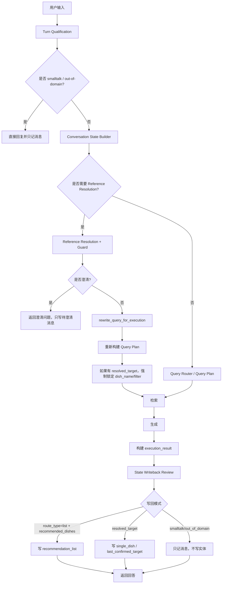

# 多轮对话新架构闭环补强 SPEC

## 背景

当前代码已经接入了新架构的主要模块：

- `turn_qualification`
- `conversation_state_builder`
- `reference_resolution`
- `execution_planner`
- `state_writeback_review`
- `ConversationManager.writeback_turn_state`

但真实链路审查显示，新架构还没有完整闭环。现在的问题不是“新模块没实现”，而是几个关键决策仍然没有贯穿到后续阶段，导致真实用户追问时出现状态丢失或检索目标漂移。

本 SPEC 用于补齐新架构的落地缺口，使系统从“模块存在”升级为“真实多轮链路可验证”。

## 当前真实问题

### 1. 自然推荐问法没有写入推荐列表状态

真实链路：

```text
用户：我晚上想吃点下饭的，有啥推荐？
系统：为您推荐以下菜品：
1. 扬州炒饭
2. 麻婆豆腐
3. 麻辣减脂荞麦面

用户：第二个怎么做？
系统：无法稳定解析第二个
```

问题原因：

- `Query Router` 已经把第一轮识别为 `route_type=list`。
- 生成阶段也确实返回了推荐列表。
- 但 `Turn Qualification` 只把少数精确问法识别为 `recommendation_query`。
- `state_writeback_review` 只在 `turn_type == recommendation_query` 时允许写入 `recent_recommendations`。
- 因此自然推荐问法会返回列表，却不会进入 `recommendation_list` 状态。

这导致序号引用、推荐列表追问、后续澄清全部失去上下文。

### 2. resolved target 没有强制进入最终 query plan

真实链路：

```text
用户：蛋炒饭怎么做？
系统：回答蛋炒饭做法

用户：有什么小技巧别粘锅？
```

新架构可以把第二轮解析为：

```json
{
  "resolved_target": "蛋炒饭",
  "target_source": "implicit_followup",
  "next_action": "apply_reference_resolution"
}
```

但执行阶段会把问题重写为：

```text
蛋炒饭有什么小技巧别粘锅
```

随后重新调用 `_build_query_plan()`。如果路由层没有稳定抽出 `dish_name=蛋炒饭`，最终检索只会带上：

```json
{
  "content_type": "tips"
}
```

这样会检索到其他菜的技巧，例如美式炒蛋、黄油煎虾，导致回答目标漂移。

### 3. 真实集成测试断言过宽

现有真实集成测试能跑通，但没有验证以下事实：

- 推荐列表第一轮是否真的写入 `recent_recommendations`。
- “第二个怎么做”是否真的映射到第二个推荐菜。
- 短追问是否真的锁定当前菜，而不是只要没有报错就算通过。
- 检索文档是否都属于 resolved target。

因此当前测试存在假阳性风险。

## 目标

1. 自然推荐问法只要最终执行为 `route_type=list` 且生成了推荐菜品，就必须写入 `recommendation_list` 状态。
2. 引用消解得到的 `resolved_target` 必须成为后续检索、生成和状态回写的强约束。
3. `Turn Qualification` 不再单独承担所有推荐识别责任；它负责前置准入，最终推荐状态由执行结果和 query plan 共同决定。
4. 真实集成测试必须验证状态、解析结果、检索目标和用户可见回答，而不只验证 HTTP 200 或非空回答。
5. 不恢复旧的独立序号解析入口，不恢复旧的 `complete_query` 主路径，不新增平行语义系统。

## 非目标

- 不重做向量检索、BM25、RRF 算法。
- 不修改 Web API 响应格式。
- 不重建知识库数据。
- 不要求模型自由决定序号映射；序号映射必须来自结构化推荐列表。
- 不把推荐列表里的“它/这个/那个”默认映射为第一项；多候选代词仍然必须澄清。

## 核心架构不变量

### 不变量 1：状态写回必须由执行结果驱动

推荐列表状态不能只依赖 `turn_info.turn_type`。

当满足以下条件时，必须写入 `recommendation_list`：

```text
execution_result.success == true
query_plan.route_type == "list"
execution_result.recommended_dishes 非空
```

推荐列表写回结果：

```json
{
  "topic_mode": "recommendation_list",
  "recent_recommendations": [
    {"rank": 1, "dish_name": "扬州炒饭"},
    {"rank": 2, "dish_name": "麻婆豆腐"},
    {"rank": 3, "dish_name": "麻辣减脂荞麦面"}
  ],
  "current_entity": null
}
```

约束：

- `recommendation_list` 写回不得同时把第一项写成 `current_entity`。
- 推荐列表模式下，纯代词追问必须澄清。
- 推荐列表模式下，明确序号追问可以解析到对应 rank。

### 不变量 2：resolved target 必须锁定检索目标

当 `resolution.next_action == "apply_reference_resolution"` 且 `resolution.resolved_target` 非空时，最终 `query_plan` 必须带上：

```json
{
  "dish_name": "<resolved_target>",
  "filters": {
    "dish_name": "<resolved_target>"
  }
}
```

该约束优先级高于 `_build_query_plan()` 的二次推断结果。

示例：

```text
原问题：有什么小技巧别粘锅？
resolved_target：蛋炒饭
重写后：蛋炒饭有什么小技巧别粘锅
最终 query_plan.dish_name：蛋炒饭
最终 filters.dish_name：蛋炒饭
```

检索层必须只在目标菜范围内找技巧内容。如果目标菜没有技巧文档，可以回退到目标菜全量内容，但不能回退到其他菜。

### 不变量 3：reference resolution 的结果必须进入 execution result

执行结果必须保留引用消解信息，供状态回写和测试诊断使用：

```json
{
  "success": true,
  "final_query_text": "蛋炒饭有什么小技巧别粘锅",
  "resolved_target": "蛋炒饭",
  "target_source": "implicit_followup",
  "query_plan_source": "rewritten",
  "retrieved_dishes": ["蛋炒饭"]
}
```

要求：

- `resolved_target` 来自 resolution，而不是从回答文本反推。
- `retrieved_dishes` 来自真实检索 parent docs。
- 如果存在 `resolved_target`，`retrieved_dishes` 不应包含其他菜名，除非明确记录为 fallback 且不用于生成最终回答。

### 不变量 4：Turn Qualification 只做前置准入，不做最终事实裁决

`Turn Qualification` 的职责：

- smalltalk early return
- 明显 out-of-domain 交给 guardrail
- 识别必须运行 reference resolution 的追问
- 给出初步 turn type

它不应该成为“是否写推荐列表状态”的唯一依据。

最终是否写入推荐列表，应由：

- `query_plan.route_type`
- `execution_result.success`
- `execution_result.recommended_dishes`

共同决定。

### 不变量 5：测试必须验证状态和真实目标

真实集成测试必须断言以下内容：

- 第一轮推荐后，`session.topic_mode == "recommendation_list"`。
- 第一轮推荐后，`session.recent_recommendations` 非空，且 rank 顺序与回答中的推荐顺序一致。
- “第二个怎么做？”后，`execution_result.resolved_target` 等于第一轮推荐列表第 2 项。
- 短追问后，检索文档只包含当前菜。
- 回答文本不得以其他菜作为主体。

## 目标流程



## 模块要求

### `state_writeback_review`

输入需要包含：

```python
review_state_writeback(
    turn_info: dict,
    resolution: dict | None,
    execution_result: dict,
    answer: str,
    query_plan: dict | None = None,
) -> dict
```

推荐列表判断规则：

```text
if query_plan.route_type == "list"
and execution_result.success
and execution_result.recommended_dishes:
    writeback_mode = "recommendation_list"
```

兼容要求：

- 如果暂时不改函数签名，也必须把 `query_plan.route_type` 注入 `execution_result`。
- 不允许继续只依赖 `turn_info.turn_type == recommendation_query`。

### `main.ask_question`

在 `rewrite_query_for_execution()` 和二次 `_build_query_plan()` 之后，必须执行 resolved target 锁定：

```text
if resolution.next_action == "apply_reference_resolution"
and resolution.resolved_target:
    query_plan.dish_name = resolution.resolved_target
    query_plan.filters.dish_name = resolution.resolved_target
```

该步骤必须发生在 `_search_relevant_chunks()` 之前。

### `ConversationManager.writeback_turn_state`

写回模式必须区分：

- `recommendation_list`
- `resolved_followup`
- `correction_turn`
- `message_only`
- `normal`

当写入 `recommendation_list` 时：

- 更新 `topic_mode`。
- 更新 `recent_recommendations`。
- 不更新 `current_entity`。

当写入 `resolved_followup` 时：

- 更新 `last_confirmed_target`。
- 如果上下文进入单菜模式，则更新 `current_entity`。
- 不覆盖仍然有效的推荐列表，除非用户已经明确选择了某一道菜并进入详情链路。

### 真实集成测试

必须新增或加强以下测试：

#### 自然推荐 + 序号追问

```text
Q1: 我晚上想吃点下饭的，有啥推荐？
Q2: 第二个怎么做？
```

断言：

- Q1 后 `recent_recommendations` 非空。
- Q2 resolved target 等于 rank 2。
- Q2 检索文档只包含 rank 2 对应菜名。
- Q2 回答不是澄清失败文案。

#### 早餐推荐 + 带评价序号追问

```text
Q1: 有没有适合新手的早餐？
Q2: 第一个看起来不错，做法说一下
```

断言：

- Q2 resolved target 等于 rank 1。
- “看起来不错”不进入菜名。
- 检索目标锁定 rank 1。

#### 单菜短追问

```text
Q1: 蛋炒饭怎么做？
Q2: 有什么小技巧别粘锅？
```

断言：

- Q2 resolved target 为 `蛋炒饭`。
- Q2 query plan 带 `dish_name=蛋炒饭`。
- Q2 retrieved dishes 只包含 `蛋炒饭`。
- 回答主体不能是其他菜。

#### 推荐列表代词澄清

```text
Q1: 今天吃什么？
Q2: 它怎么做？
```

断言：

- Q2 不能默认选择第一项。
- Q2 返回澄清问题。
- 不更新 `current_entity`。

## 验收标准

1. 自然推荐问法后，系统状态稳定进入 `recommendation_list`。
2. 序号追问可以映射到对应 rank，且不会把“第一个/第二个”当菜名。
3. 单菜短追问必须继承当前菜，并强制锁定检索目标。
4. 推荐列表中的纯代词追问仍然澄清，不做默认选择。
5. 真实集成测试必须能捕获“状态没写入”和“检索目标漂移”两类问题。
6. 所有新增能力必须通过新架构链路完成，不恢复旧的平行序号解析模块。

## 风险与约束

- 自然推荐问法由 `query_plan.route_type=list` 决定，可能受路由模型波动影响；测试应断言最终状态，而不是只断言分类函数。
- `resolved_target` 强制锁定可能掩盖 `_build_query_plan()` 的抽取问题；但在引用消解场景中，resolution 是更高优先级的结构化结论，应该覆盖二次推断。
- 检索层如果没有目标菜对应内容，应优先在同菜全量内容内 fallback，而不是跨菜 fallback。
- 真实集成测试依赖 API Key 和模型输出，断言应尽量检查结构化状态与检索目标，减少对回答措辞的依赖。

## 全流程剩余漏洞补全

本节覆盖本次审查中未被前文两个硬故障完全覆盖的全流程漏洞。它们不一定每个都会立刻造成用户可见错误，但都会削弱“新架构是唯一主链路”的确定性。

### 1. 旧逻辑残留导致双主线风险

当前 `ConversationManager` 中仍保留旧方法：

- `complete_query`
- `_resolve_entity_references`
- `_inherit_intent`
- `_is_intent_switch`

这些方法的设计前提是旧架构：

```text
current_entity + current_intent + 字符串补全
```

新架构的设计前提是：

```text
structured snapshot + reference resolution + guarded execution plan
```

两者不能同时作为主流程存在。否则一轮输入可能先被旧字符串补全污染，再进入新引用消解，导致状态来源不可解释。

### 2. 普通接口和流式接口可能不一致

`/api/chat` 和 `/api/chat/stream` 都调用 `ask_question()`，但流式模式会延迟状态写回，直到 generator 被消费完成。

风险：

- 前端中断流式响应时，状态可能没有写回。
- 流式链路的 `execution_result.answer` 只有消费完才完整。
- 普通接口通过的多轮状态测试，不代表流式接口也通过。

要求：

- 普通接口和流式接口必须共享同一套 turn qualification、reference resolution、query plan、retrieval、writeback review。
- 流式接口在完整消费后，状态必须与普通接口一致。
- 如果流式响应被中断，不能写入可靠实体状态；最多只记录一条不可靠消息或不写入。

### 3. execution_result 可观测性不足

当前 `execution_result` 还不足以完整解释一轮回答为什么这样生成。

全流程闭环要求每轮至少可观察：

```json
{
  "success": true,
  "final_query_text": "蛋炒饭有什么小技巧别粘锅",
  "query_plan_source": "rewritten",
  "route_type": "detail",
  "filters": {"content_type": "tips", "dish_name": "蛋炒饭"},
  "resolved_target": "蛋炒饭",
  "target_source": "implicit_followup",
  "retrieved_dishes": ["蛋炒饭"],
  "recommended_dishes": []
}
```

要求：

- 推荐列表场景必须记录 `recommended_dishes`。
- 详情场景必须记录 `retrieved_dishes`。
- 引用消解场景必须记录 `resolved_target` 和 `target_source`。
- 状态写回不得从自然语言回答里反推实体，应优先消费结构化 `execution_result`。

### 4. 状态健康与污染防护不足

需要明确哪些输入不能污染状态：

- smalltalk，例如“你好”“谢谢”
- out-of-domain，例如“你昨天吃了什么”
- guardrail refusal
- clarification answer
- failed retrieval
- ambiguous followup
- stream interrupted turn

这些输入最多写入消息历史，不得更新：

- `current_entity`
- `last_confirmed_target`
- `recent_recommendations`
- `topic_mode`

如果某轮产生澄清问题，应写入：

```json
{
  "pending_clarification": {
    "reason": "ambiguous_reference",
    "candidates": ["蛋炒饭", "麻婆豆腐"],
    "original_question": "它怎么做？"
  }
}
```

下一轮如果用户回答“第二个”或直接说菜名，应能消费 pending clarification，而不是重新从零开始猜。

### 5. route_type 与 turn_type 边界不清

新架构中必须明确：

- `turn_type` 是前置准入分类。
- `route_type` 是检索/生成执行分类。
- 状态写回不能只依赖 `turn_type`。
- 推荐列表是否成立，以 `route_type=list + recommended_dishes` 为准。
- 详情追问是否成立，以 `resolution + query_plan + retrieved_dishes` 为准。

这可以避免自然语言推荐问法因为没有命中 `RECOMMENDATION_EXACT_PATTERNS` 而丢失推荐列表状态。

## 旧逻辑去留决策

| 旧逻辑/模块 | 决策 | 原因 | 迁移要求 |
|---|---|---|---|
| `ConversationManager.complete_query` | 本轮先 deprecated，不直接物理删除 | 它会执行旧式字符串补全，与新 reference resolution 冲突；但短追问等旧覆盖场景可能仍暴露新链路缺口 | 主流程不得调用；方法保留并发出 deprecation warning；验证新链路覆盖后，在本 plan 后置收尾任务中物理删除 |
| `_resolve_entity_references` | 本轮先 deprecated，不直接物理删除 | 直接把“它/这个/那个”替换为 `current_entity`，违反推荐列表多候选澄清原则；但可作为对照测试帮助发现新链路缺口 | 不允许被主流程调用；能力迁移到 `reference_resolution`；后置收尾任务删除 |
| `_inherit_intent` | 本轮先 deprecated，不直接物理删除 | 基于 `current_intent` 拼接字符串，容易制造伪菜名和错误意图；但短追问能力需要先被新链路证明覆盖 | 不允许被主流程调用；能力迁移到 `rewrite_query_for_execution`；后置收尾任务删除 |
| `_is_intent_switch` | 保留思想，不保留主流程调用方式 | 意图切换仍重要，但不能在旧 manager 内重置状态 | 迁移到 `turn_qualification` 或独立 `topic_switch_detection` |
| `_reset_session` / `reset_session` | 保留 | 手动清会话和过期清理仍需要 | 不参与语义判断 |
| `add_interaction` | 保留 | 消息历史记录仍需要 | 不得隐式更新实体，除非调用方明确传入可靠实体 |
| `record_recommendations` | 保留 | 新架构需要推荐列表状态 | 输入必须来自 `execution_result.recommended_dishes` |
| `set_current_dish` | 保留 | 新架构需要单菜状态 | 输入必须来自 explicit query、correction、resolved followup |
| `get_current_entity` | 暂时保留兼容 | 部分旧调用可能仍依赖 | 新代码优先读取 snapshot，不直接依赖该方法 |
| `_should_inherit_current_entity` | 本轮迁移/降级，不直接删除 | 如果仍在主流程直接改 query，会绕过 reference resolution | 只允许作为 `implicit_followup` 的低风险特征提取，不得直接改 query；后置收尾任务确认是否删除 |
| `_build_query_plan` | 保留 | 仍是检索路由核心 | 其结果必须可被 `resolved_target` 覆盖 |
| `_maybe_handle_guardrail_query` | 保留 | 越界问题仍需礼貌拒答 | 顺序固定为 smalltalk early return 后、检索前 |
| `generate_smalltalk_answer` | 保留 | smalltalk 和 refusal 概念必须分离 | smalltalk 不进入检索，不更新实体状态 |

## 全流程目标闭环

最终主链路必须固定为：

```text
Web request
-> input validation
-> Turn Qualification
-> smalltalk early return OR guardrail
-> Conversation State Builder
-> Reference Resolution when needed
-> Resolution Guard
-> Execution Planning
-> Query Router / Query Plan
-> rewrite_query_for_execution
-> apply resolved_target to query_plan
-> Retrieval
-> Generation
-> build execution_result
-> State Writeback Review
-> ConversationManager writeback
-> response
```

禁止的主链路：

```text
Web request
-> ConversationManager.complete_query
-> old string reference resolution
-> new reference resolution
```

禁止原因：

- 旧链路会提前改变用户问题。
- 新链路无法知道哪些内容是用户原话、哪些是旧规则补出来的。
- 状态写回无法解释实体来源。

## 状态写回模式终稿

`State Writeback Review` 最终应输出以下模式之一：

| writeback_mode | 触发条件 | 允许更新 |
|---|---|---|
| `message_only` | smalltalk、out-of-domain、guardrail refusal、failed retrieval、stream interrupted | 只写消息 |
| `clarification_pending` | ambiguous reference、ordinal out of range、pronoun in recommendation list | `pending_clarification` |
| `recommendation_list` | `route_type=list` 且 `recommended_dishes` 非空 | `topic_mode`、`recent_recommendations` |
| `resolved_followup` | `resolution.resolved_target` 且检索成功 | `last_confirmed_target`、必要时 `current_entity` |
| `correction_turn` | 用户显式纠正 | `current_entity`、`last_confirmed_target` |
| `explicit_single_dish` | 用户直接问某道菜详情且检索成功 | `current_entity`、`last_confirmed_target` |
| `normal` | 普通领域问答，无可靠实体 | 消息和普通意图 |

约束：

- `message_only` 不能更新实体。
- `clarification_pending` 不能更新实体。
- `recommendation_list` 不能自动设置 `current_entity`。
- `resolved_followup` 必须有成功检索作为支撑。
- `explicit_single_dish` 必须来自 query plan 的明确菜名，不能来自回答文本猜测。

## 普通与流式等价验收

同一组问题必须在 `/api/chat` 和 `/api/chat/stream` 下得到等价状态：

```text
Q1: 我晚上想吃点下饭的，有啥推荐？
Q2: 第二个怎么做？
```

验收：

- 两种接口 Q1 后都写入 `recommendation_list`。
- 两种接口 Q2 都解析到 rank 2。
- 两种接口 Q2 都锁定同一个 `resolved_target`。
- 两种接口最终 `current_entity`、`last_confirmed_target` 一致。

流式中断验收：

- 如果 generator 未消费完，不允许写入可靠实体状态。
- 不能出现“回答没完整发出，但状态已经切到某道菜”的情况。

## 最终验收矩阵

| 场景 | 输入 | 预期状态 | 预期行为 |
|---|---|---|---|
| smalltalk | `你好` | 不更新实体 | 礼貌回复 |
| out-of-domain | `你昨天吃了什么` | 不更新实体 | 委婉拒答 |
| 自然推荐 | `我晚上想吃点下饭的，有啥推荐？` | `recommendation_list` | 返回推荐列表 |
| 序号追问 | `第二个怎么做？` | resolved 到 rank 2 | 检索 rank 2 菜品 |
| 推荐代词追问 | `它怎么做？` | `pending_clarification` | 请求用户说明第几个 |
| 显式选择 | `那蛋炒饭需要哪些食材？` | `current_entity=蛋炒饭` | 检索蛋炒饭食材 |
| 单菜短追问 | `有什么小技巧别粘锅？` | 继承当前菜 | 只检索当前菜 |
| 用户纠正 | `不是这个，是蛋炒饭` | `current_entity=蛋炒饭` | 查询蛋炒饭 |
| 检索失败 | `不存在的菜怎么做？` | 不更新可靠实体 | 失败提示 |
| 澄清失败 | `那个呢？` 且多候选 | 不更新实体 | 澄清 |
| 流式完整消费 | 同普通接口 | 状态等价 | 正常写回 |
| 流式中断 | 消费一半后断开 | 不写可靠实体 | 不污染状态 |

## 后续 Plan 应覆盖

1. 先补失败测试，证明当前自然推荐写回和短追问检索目标会失败。
2. 修改 `state_writeback_review`，让推荐列表写回由 `query_plan + execution_result` 驱动。
3. 修改 `main.ask_question`，在检索前强制应用 `resolution.resolved_target` 到 query plan。
4. 扩展 `execution_result`，记录 `resolved_target`、`target_source`、`retrieved_dishes`。
5. 清理旧主链路第一阶段：将 `complete_query`、`_resolve_entity_references`、`_inherit_intent` 标记 deprecated，断开生产调用可能性，但暂不物理删除。
6. 收紧 `add_interaction`，避免它在非可靠写回模式下隐式更新 `current_entity`。
7. 增加 `clarification_pending` 和 stream interrupted 的状态规则。
8. 加强真实集成测试断言，防止假阳性。
9. 补普通接口和流式接口等价测试。
10. 跑单元测试、真实链路测试和流式链路测试。
11. 在同一份 plan 的后置收尾任务中，只有当真实链路矩阵通过且 grep 证明无生产调用后，才物理删除 deprecated 旧方法。
